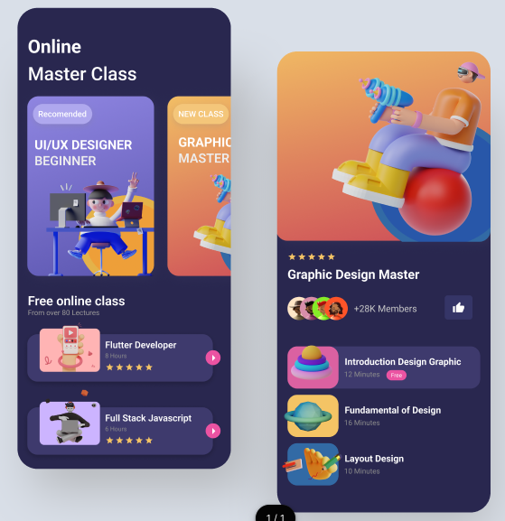

# UI design for Online Course App

## Figma to Flutter Design

Image:-

## Figma File

`figma.com/community/file/1064411999504285367`

## Output Video
[vide](https://github.com/Chirran-CR/Course-Selling-App-UI-Design/assets/105117991/7fba445c-2b43-4fc6-af5a-e260a0f34c7f)

file:///home/chirran/coding/Learning/Flutter/UI%20Design/online_course_app/assets/video/vdo.mp4

## Getting Started

This project is a starting point for a Flutter application.

A few resources to get you started if this is your first Flutter project:

- [Lab: Write your first Flutter app](https://docs.flutter.dev/get-started/codelab)
- [Cookbook: Useful Flutter samples](https://docs.flutter.dev/cookbook)

For help getting started with Flutter development, view the
[online documentation](https://docs.flutter.dev/), which offers tutorials,
samples, guidance on mobile development, and a full API reference.
